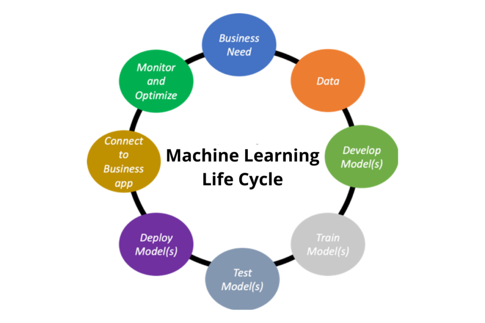
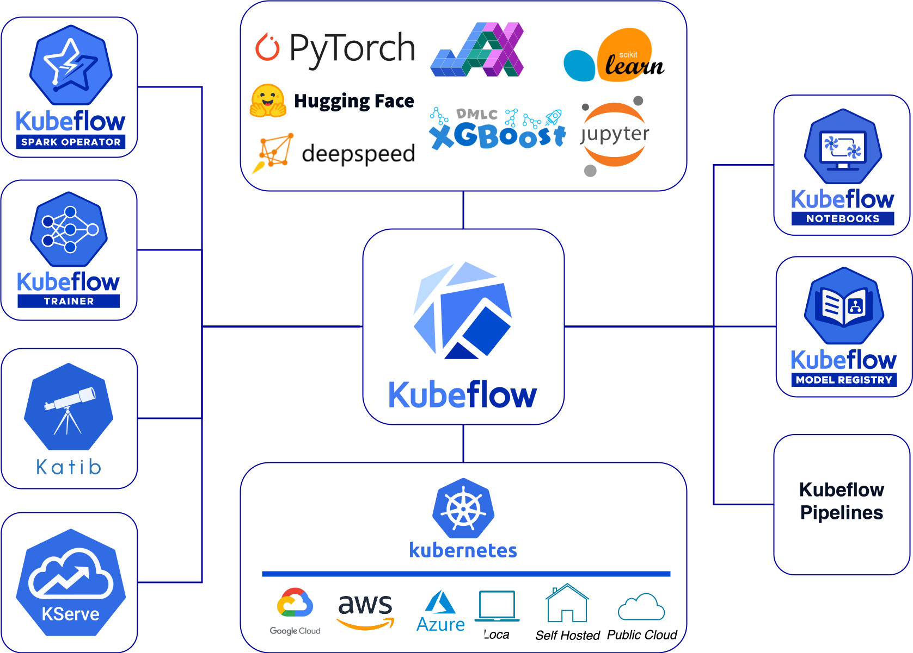
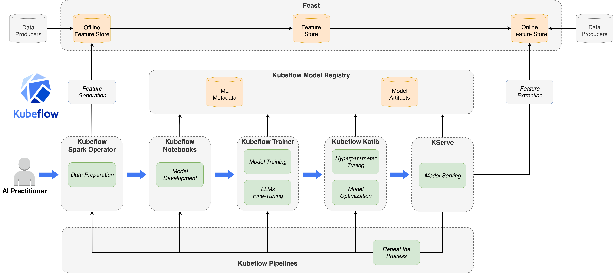
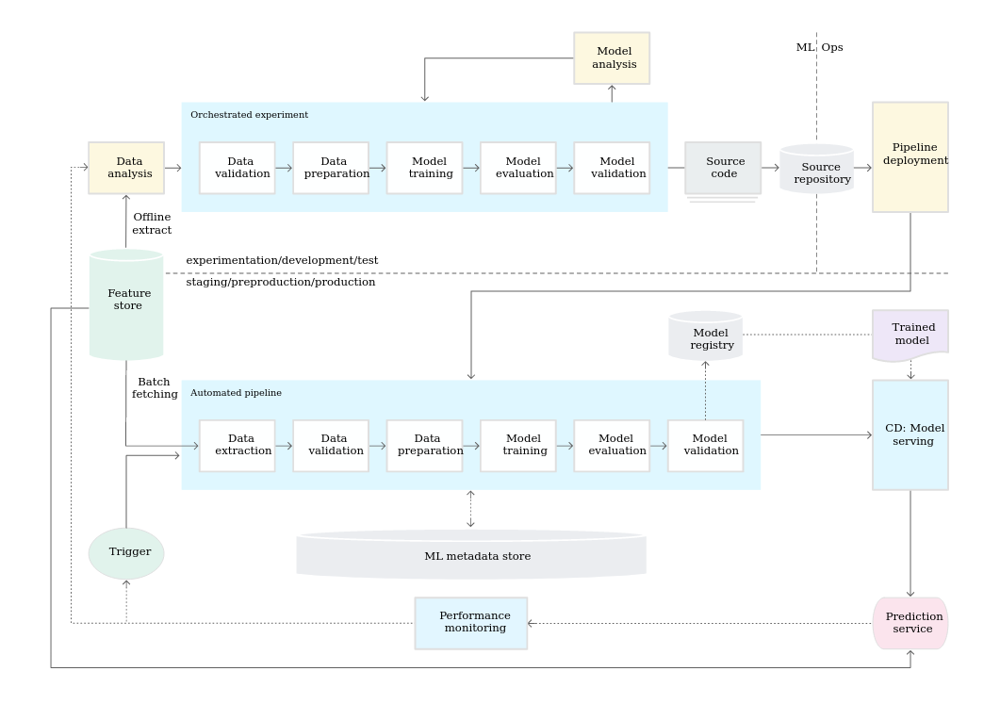
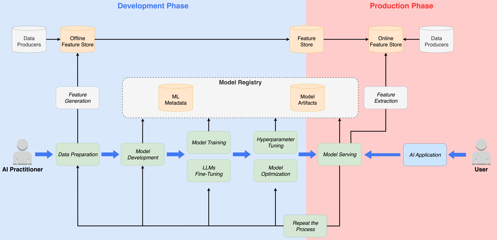

# End-to-end ML platforms

## Architectural complexitiy

- Getting a model to production takes many steps
- Many different stakeholders will participate
- Many different tools will be used
- Even after the deployment the pipelines will evolve
- **=> The process is complex and it takes lots of time and maintenance**

## Solution

- A tool that treats multiple steps from development to deployment: **end-to-end ML platform**
- More and more platforms is appearing
- Several are open-source, mostly they are managed
- They mostly started as in-house solutions (Google, Uber, Netflix, AirBnB...)
- They focus on different parts of the process (no unified definition)
- Can be framework-specific (TensorFlow Extended) or framework agnostic (Liminal) (both open-source)  
- Cloud providers offer many services, including MLOps toolstacks

## Machine learning lifecycle

End-to-end ML platforms covers the most steps of ML lifecycle: train, evaluate and serve model.

## Platform comparison

[Check out the link](https://valohai.com/mlops-platforms-compared/)

## Kubeflow

- Created by Google
- Open source
- Based on Kubernetes
- Scalable
- Deployement: entire AI reference platform or each component independently
- Multi‑framework

### Kubeflow components

***Kubeflow Notebooks***

Allows you to launch and manage interactive development environments (JupyterLab, VS Code, RStudio) directly within the Kubernetes cluster, enabling you to explore data and prototype models as close as possible to the infrastructure.

***Kubeflow Pipelines***

Enables you to define, run, version, and replay containerized ML pipelines (ETL, training, evaluation, deployment) with a UI, artifact storage, and job management.

***Kubeflow Trainer***

Enables the orchestration of distributed model training (TFJob, PyTorchJob, XGBoostJob, etc.) on Kubernetes.

***Kubeflow KServe***

Enables the deployment and serving of ML models as endpoints on Kubernetes.

***Kubeflow Model Registry***

Enables you to store, version, and manage model metadata (artifacts, versions, statuses such as "staged"/"production") and then reference them in pipelines or KServe.

***Kubeflow Katib***

Enables the automation of hyperparameter optimization (HPO) and, in some cases, model discovery (lightweight AutoML), by launching and evaluating experiments at scale on Kubernetes.

***Kubeflow Spark Operator***

Enables you to submit and manage Apache Spark jobs as Kubernetes resources (CRDs) to run data processing or Spark ML natively within the cluster.

### How it works

## Comparison of the initial pipeline and Kubeflow

**Initial pipeline:**

**Kubeflow:**

---

*The content of this document, including all text, images, and associated materials, is the exclusive property of Adaltas and is protected by applicable copyright laws. Unauthorized distribution, reproduction, or sharing of this content, in whole or in part, is strictly prohibited without the express written consent of the author(s). Any violation of this restriction may result in legal action and the imposition of penalties as prescribed by law.*
