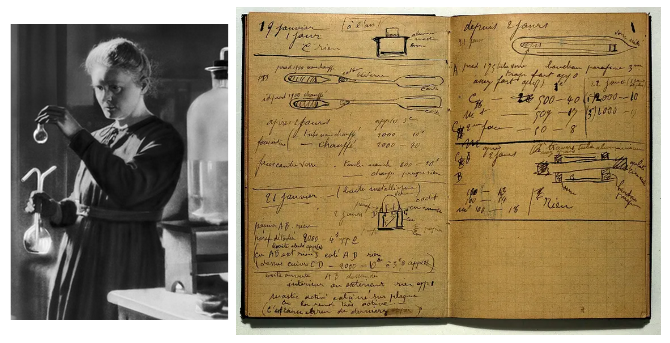
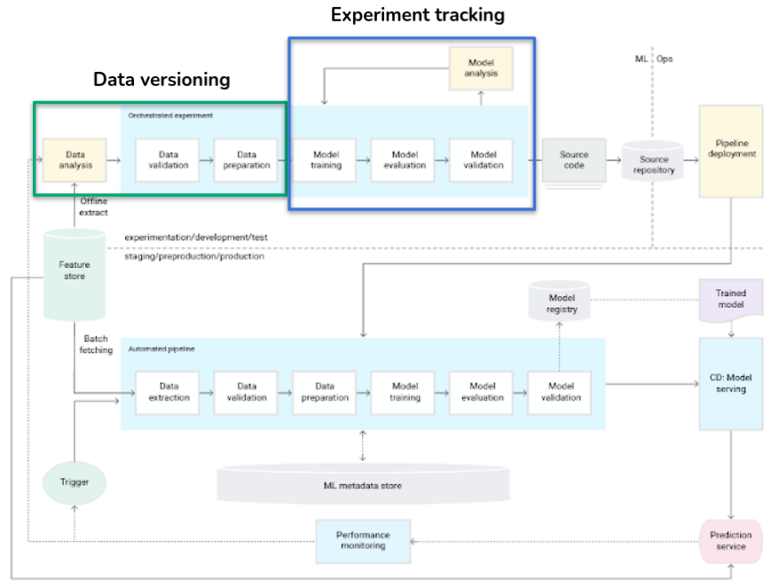
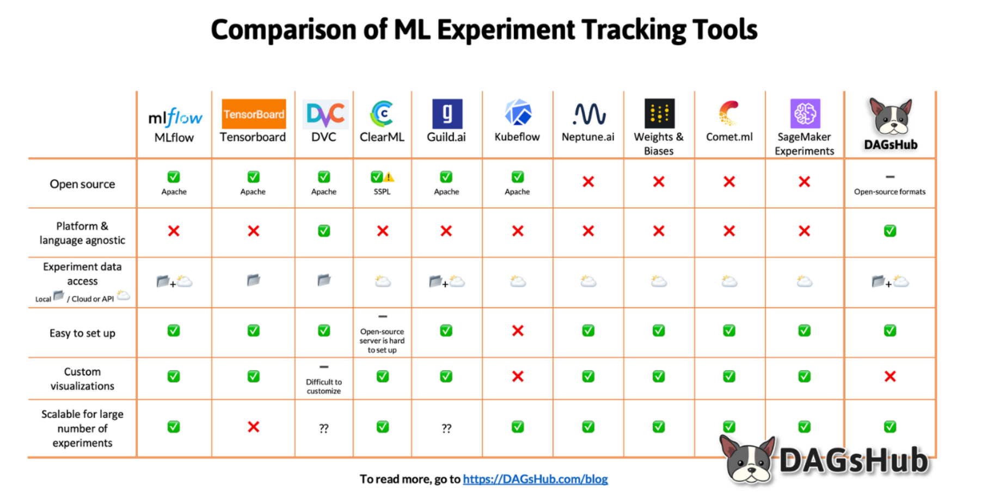

# Experiment tracking

## Motivations

Experimentation requires bookkeeping.

- To know what was done
- How it was done
- What else there is to be done

## Roadmap

## Objectives

- During model development, we test many different things:
  - Algorithms
  - Parameters
  - Datasets (split, sampling…)
  - Features (engineering, selection)

- In long term, we would like to memorize **what** we tested and **how**
- In short term, we would like to **compare results** (easily) to keep the best model

- To be able to compare different models, we need to track (record):
  - Statistical **metrics**
  - Business metrics
  - Other **artifacts** (plots)
  - The **dataset**
- To reproduce the training/execution, we need to track the **environment** (libraries, versions)

## Tools

- Many tools available and they mostly offer end-to-end ML lifecycle management.
- We will use **Kubeflow**.

[Reference](https://dagshub.com/blog/how-to-compare-ml-experiment-tracking-tools-to-fit-your-data-science-workflow/)

## Practical example

- We will focus on **experiment tracking**.
- We will be using **Kubeflow Pipelines**.

---

*The content of this document, including all text, images, and associated materials, is the exclusive property of Adaltas and is protected by applicable copyright laws. Unauthorized distribution, reproduction, or sharing of this content, in whole or in part, is strictly prohibited without the express written consent of the author(s). Any violation of this restriction may result in legal action and the imposition of penalties as prescribed by law.*
