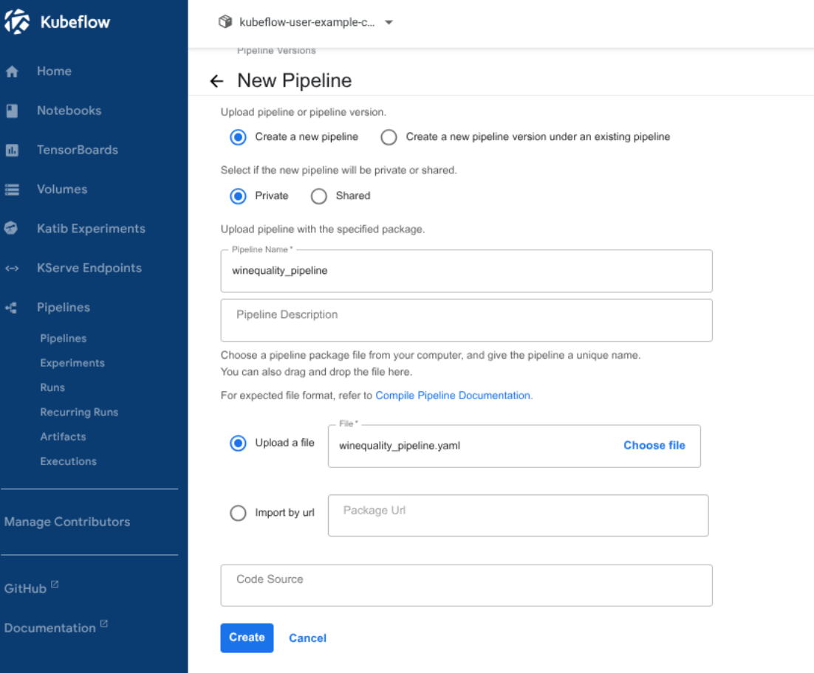

# Experiment tracking

Tracking experiments is essential for understanding and improving the performance of machine learning models. This work uses Kubeflow Pipelines to organize and track experiments. Metrics and configurations are automatically recorded. This allows to effectively compare different models and parameters and improve reproducibility.

## Objectives

- Demonstrate how experiment tracking helps with linking the code, the results and the environment details.
- Note how this increases the reproducibility.

## Tasks

1. Create lab pod (easy level)
2. Create pipeline (easy level)
3. Pipeline submission (easy level)
4. Try different parameters (easy level)
5. Change the model to Random Forest (easy level)

## Prerequisite

Install Minikube and Kubeflow by following the [03.end-to-end-ml](../03.end-to-end-ml/lab-kubeflow.md) lab.

## Part 1. Create lab pod (easy level)

A lab pod is created with the [kfp](https://pypi.org/project/kfp/) module installed to use KFP Python SDK.

> Note: the KFP Python SDK transforms a Python function into a component by generating its interface (inputs/outputs) and execution specification (container, dependencies, environment).
Compile and generatethe IR YAML file.

```bash
K8S_LAB_POD="kfp-lab"
cat <<YAML | kubectl apply -f -
apiVersion: v1
kind: Pod
metadata:
  name: $K8S_LAB_POD
  namespace: kubeflow-user-example-com
spec:
  securityContext:
    runAsNonRoot: true
    runAsUser: 1000
    seccompProfile:
      type: RuntimeDefault

  containers:
  - name: python
    image: python:3.10-slim
    
    env:
      - name: HOME
        value: /home/python
      - name: PATH
        value: /home/python/.local/bin:/usr/local/sbin:/usr/local/bin:/usr/sbin:/usr/bin:/sbin:/bin        
      - name: KF_PIPELINES_SA_TOKEN_PATH
        value: /var/run/secrets/kubeflow/pipelines/token

    command:
      - /bin/sh
      - -c
      - |
        mkdir -p \$HOME && \
        pip install --user --upgrade pip && \
        pip install --user kfp && \
        sleep 3600

    securityContext:
      allowPrivilegeEscalation: false
      capabilities:
        drop:
          - ALL

    volumeMounts:
    - name: workspace
      mountPath: /workspace
    - name: home
      mountPath: /home/python
    - name: volume-kf-pipeline-token
      mountPath: /var/run/secrets/kubeflow/pipelines
      readOnly: true

  volumes:
  - name: workspace
    emptyDir: {}
  - name: home
    emptyDir: {}
  - name: volume-kf-pipeline-token
    projected:
      sources:
      - serviceAccountToken:
          path: token
          expirationSeconds: 7200
          audience: pipelines.kubeflow.org
YAML
# pod/kfp-lab created
kubectl wait --for=condition=Ready pod $K8S_LAB_POD -n kubeflow-user-example-com --timeout=300s
# pod/kfp-lab condition met
```

## Part 2. Create pipeline (easy level)

- The python file is created in the lab pod.

```bash
kubectl -n kubeflow-user-example-com exec $K8S_LAB_POD -- bash -c '
cat > /workspace/winequality_pipeline.py <<EOF
import kfp.compiler as compiler
from kfp import dsl
from kfp.dsl import Dataset, Input, Metrics, Model, Output, component, pipeline

@component(base_image="python:3.10", packages_to_install=["pandas", "scikit-learn"])
def get_dataset(
    train_data: Output[Dataset],
    test_data: Output[Dataset],
):
    import pandas as pd
    from sklearn.model_selection import train_test_split

    # Read the wine quality csv file from the URL
    csv_url =\
        "http://archive.ics.uci.edu/ml/machine-learning-databases/wine-quality/winequality-red.csv"
    df = pd.read_csv(csv_url, sep=";")
    # Split dataset into training and test sets. (0.75, 0.25) split.
    train, test = train_test_split(df)
    # Save the test and train dataset in separate files
    train.to_csv(train_data.path, index=False)
    test.to_csv(test_data.path, index=False)    
    print("Dataset loaded")

@component(
    base_image="python:3.10", packages_to_install=["pandas", "scikit-learn"]
)
def train(
    train_data: Input[Dataset],
    test_data: Input[Dataset],
    metrics: Output[Metrics],
    alpha: float = 0.5,
    l1_ratio: float = 0.5,
):
    import pandas as pd    
    import numpy as np
    from sklearn.linear_model import ElasticNet
    from sklearn.metrics import mean_absolute_error, mean_squared_error, r2_score
    import json
        
    train = pd.read_csv(train_data.path)
    train_x = train.drop(["quality"], axis=1)
    train_y = train[["quality"]]    
    test = pd.read_csv(test_data.path)
    test_x = test.drop(columns=["quality"])
    test_y = test["quality"]
    # Execute ElasticNet
    lr = ElasticNet(alpha=alpha, l1_ratio=l1_ratio, random_state=42)
    lr.fit(train_x, train_y)
    
    # Evaluate metrics
    test_y_pred = lr.predict(test_x)
    metrics_results = {
        "rmse": np.sqrt(mean_squared_error(test_y, test_y_pred)),
        "mae": mean_absolute_error(test_y, test_y_pred),
        "r2": r2_score(test_y, test_y_pred),
    }
    with open(metrics.path, "w") as f:
        json.dump(metrics_results, f, indent=4)
    print("Evaluation done:", metrics_results)

@pipeline(
    name="Wine-quality-pipeline",
    description="Elasticnet Pipeline with dependencies",
)
def wine_quality_pipeline(
    alpha: float = 0.5, 
    l1_ratio: float = 0.5
):
    collect_dataset_op = get_dataset()
    train_op = train(
        train_data=collect_dataset_op.outputs["train_data"],
        test_data=collect_dataset_op.outputs["test_data"],
        alpha=alpha,
        l1_ratio=l1_ratio
    )

if __name__ == "__main__":
  compiler.Compiler().compile(
    pipeline_func=wine_quality_pipeline, package_path="/workspace/winequality_pipeline.yaml"
  )
EOF
'
```

- The IR YAML file of the pipeline is generated when python file is executed.

> Note: The pipeline is compiled with Kubeflow Pipelines SDK compiler into Intermediate Representation YAML. The [IR YAML](https://www.kubeflow.org/docs/components/pipelines/concepts/ir-yaml/) serves as an intermediate format that translates pipeline definitions into backend-executable workflows.

```bash
kubectl -n kubeflow-user-example-com exec $K8S_LAB_POD -- bash -c '
python3 /workspace/winequality_pipeline.py
'
```

- Try to understand the pipeline definition and the structure of python code. Take a look at the YAML file.

## Part 3. Pipeline submission (easy level)

Submit your pipeline through KFP Dashboard by downloading IRL YAML from lab pod with the command below.

```bash
kubectl -n kubeflow-user-example-com cp "$K8S_LAB_POD":workspace/winequality_pipeline.yaml winequality_pipeline.yaml
```

Copy it from the VM to your host machine. Replace the variables `<USERNAME>`,  `<VM_IP>` and `<LOCAL_PATH>` with the right values. 

```bash
scp <USERNAME>@<VM_IP>:/home/ubuntu/winequality_pipeline.yaml <LOCAL_PATH>
```

From pipeline UI, the IR YAML file is uploaded by clicking on `+ Upload pipeline` button. On the next page, upload the yaml file, fill the form and click on `Create` button. It shows the pipeline's DAG with his components.



The pipeline is submitted by clicking on `+ Create run` button, then populate form and click on `start` button.

## Part 4. Try different parameters (easy level)

- Track the model metrics. 
- Explore your runs by cliking on submenus under `Pipelines` menu in the left side panel.

## Part 5. Change the model to Random Forest (easy level)

- Track some more experiments and compare the results.

## Further reading

- Learn more about [KFP Python SDK](https://kubeflow-pipelines.readthedocs.io/en/sdk-2.16.0/)
